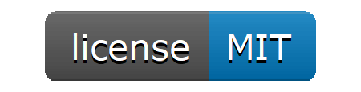
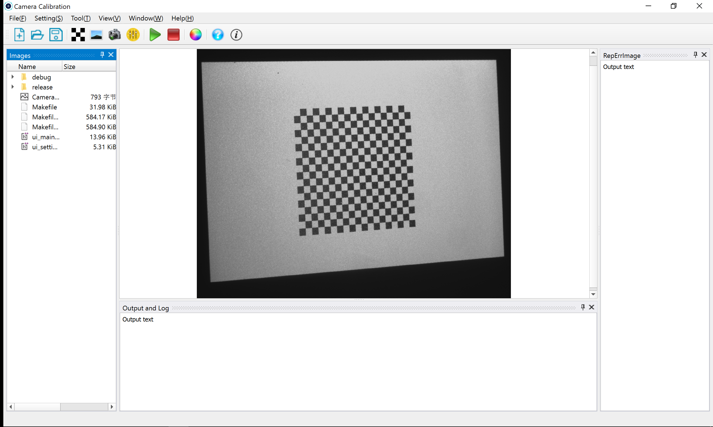
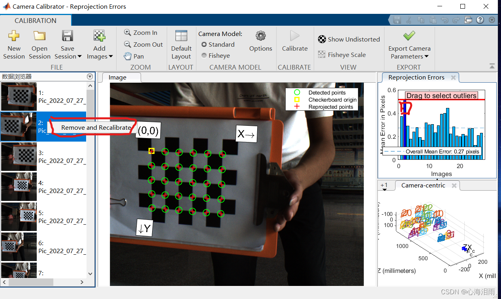

# CameraCalibration

--------------
- [Design goals](#design-goals)
- [Dependence](#dependence)
- [Build and Run](#Build and Run)
---------------
## Design goals
A simple program for camera calibration based on Qt+OpenCV4,UI like Matlab's calibrate toolbox. Downside is mine ui :
[]
Downside is Matlab Calibration Toolbox UI :
[]

## Dependence
1. Qt 5.14
2. OpenCV4.11
3. libcbdetect(https://github.com/ftdlyc/libcbdetect.git)
4. libDockingPanes(https://github.com/KestrelRadarSensors/dockingpanes) or Qt-Advanced-Docking-System(https://github.com/mfreiholz/Qt-Advanced-Docking-System)
5. nlohmann/json(https://github.com/nlohmann/json)   or pugixml(https://github.com/zeux/pugixml)

## Build and Run
1. Use cmake : ....
2. Direct use Qt open "CameraCalibration.pro" and build .
3. 